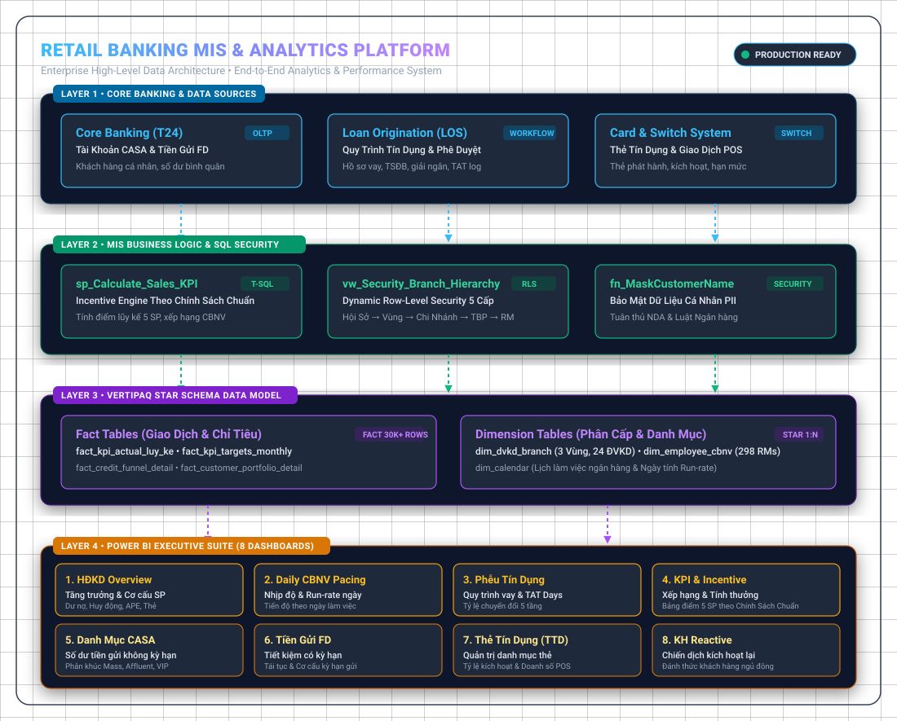
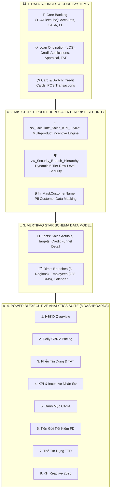

# 🏦 Enterprise Retail Banking MIS & Sales Performance Analytics Platform
> **Nền Tảng Phân Tích Dữ Liệu Hoạt Động Kinh Doanh & Hiệu Suất Bán Hàng Ngân Hàng Bán Lẻ**

<p align="center">
  <a href="#-english"><b>English Overview</b></a> •
  <a href="#-tiếng-việt"><b>Tổng Quan Tiếng Việt</b></a> •
  <a href="#-data-architecture"><b>Kiến Trúc Dữ Liệu</b></a> •
  <a href="#-8-dashboards-suite"><b>Bộ 8 Dashboard</b></a>
</p>

[](https://powerbi.microsoft.com)
[](https://microsoft.com)
[](https://python.org)
[](https://github.com)

---

## 🌐 English

An enterprise-grade Business Intelligence and Management Information System (MIS) solution simulating a Top Commercial Bank's Retail Banking Division. Designed to bridge the gap between core banking transaction logs and executive decision-making across Regions, Business Units (Branches), Team Leaders, and Frontline Relationship Managers (RM).

### 🌟 High-Level Architecture & Data Flow

<p align="center">
  
</p>

<details>
<summary><b>🔍 Click here to view Architecture Data Flow (Mermaid Specification)</b></summary>



</details>

---

## 🇻🇳 Tiếng Việt

Dự án mô phỏng toàn diện giải pháp Hệ thống Thông tin Quản lý (MIS) và Phân tích Dữ liệu Kinh doanh (Business Intelligence) của một Ngân hàng Thương mại Bán lẻ quy mô lớn. Hệ thống giải quyết trọn vẹn bài toán từ khâu tổng hợp dữ liệu giao dịch đa sản phẩm, tự động hóa tính điểm KPI theo chính sách (Chính Sách KPI & Incentive), đến xây dựng hệ thống báo cáo phục vụ từ Ban Lãnh đạo Khối đến từng Chuyên viên QHKH (RM).

### 🎯 3 Trụ Cột Kỹ Thuật Đột Phá

#### 1. 🛡️ Cơ Chế Bảo Mật Ma Trận Phân Quyền (Dynamic Row-Level Security) & Data Masking
* **Phân quyền ma trận theo chức danh:** Ánh xạ cấu trúc tổ chức ngân hàng 5 cấp:
  * **Cấp 1 (Hội sở / MIS):** Xem dữ liệu toàn hàng.
  * **Cấp 2 (Giám đốc Vùng):** Chỉ xem các chi nhánh trực thuộc Vùng (Miền Bắc, Miền Trung, Miền Nam).
  * **Cấp 3 (Cán bộ quản lý - Giám đốc Chi nhánh):** Toàn quyền xem nhân sự và kết quả kinh doanh tại ĐVKD.
  * **Cấp 4 (Trưởng bộ phận - TBP):** Quản lý nhân sự trong phòng ban/tổ nhóm.
  * **Cấp 5 (Cán bộ bán hàng - RM/PBO):** Chỉ thấy thông tin khách hàng và điểm số cá nhân của chính mình.
* **Tự động làm sạch dữ liệu cá nhân (Data Masking):** Ứng dụng hàm SQL `fn_MaskCustomerName` che mờ tên khách hàng (`Nguyễn * * An`) tuân thủ nghiêm ngặt Luật An toàn Thông tin và bảo mật ngân hàng.

#### 2. ⚡ Thuật Toán Tính Pacing & Điểm KPI Đa Sản Phẩm (Incentive Engine)
* **Dự báo điểm rơi doanh số (Run-rate Projection):** Thuật toán DAX dựa trên tỷ lệ ngày làm việc thực tế đã qua (`[Working Days Passed] / [Total Working Days in Month]`) để cảnh báo sớm nguy cơ không hoàn thành chỉ tiêu ngay từ giữa tháng.
* **Trọng số KPI chuẩn ngành ngân hàng:** Tín dụng 35%, CASA 25%, Tiền gửi có kỳ hạn 15%, Bảo hiểm APE 15%, Thẻ tín dụng 10% $\rightarrow$ Tự động xếp hạng cán bộ (Hạng A, B, C, D) và ước tính tiền thưởng Incentive hàng tháng.

#### 3. 📊 Bộ 8 Dashboard Chuyên Sâu Tối Ưu Cho Khối Khách Hàng Cá Nhân
1. **Báo cáo Hoạt Động Kinh Doanh (HDKD):** Overview toàn hàng, Chi tiết Cơ cấu Sản phẩm, Tín dụng và Xếp hạng Chi nhánh.
2. **Báo cáo Daily CBNV (Daily Pacing):** Nhịp độ bán hàng hàng ngày, phát hiện ngày không phát sinh số và dự phóng Run-rate.
3. **Báo cáo Phễu Bán Hàng Tín Dụng:** Đo lường tỷ lệ chuyển đổi qua 5 bước (Tiếp nhận $\rightarrow$ Thẩm định $\rightarrow$ Phê duyệt $\rightarrow$ TSĐB $\rightarrow$ Giải ngân) và thời gian xử lý hồ sơ (TAT Days).
4. **Báo cáo KPI & Incentive:** Bảng điểm minh bạch đo lường hiệu suất và tính thưởng cho RM, TBP, CBQL theo Chính Sách Chuẩn.
5. **Dashboard Danh mục CASA 2025:** Phân khúc số dư không kỳ hạn theo Mass, Affluent, VIP.
6. **Dashboard Danh mục FD 2025:** Tỷ lệ tái tục tiền gửi tiết kiệm và cơ cấu kỳ hạn.
7. **Dashboard Danh mục Thẻ Tín Dụng (TTD):** Tỷ lệ kích hoạt chi tiêu và doanh số quẹt thẻ bình quân.
8. **Dashboard Khách Hàng REACTIVE:** Đo lường hiệu quả chiến dịch "Đánh thức khách hàng ngủ đông".

---

## 📂 Project Structure / Cấu Trúc Thư Mục

```
.
├── 01_synthetic_data_generator/
│   └── generate_banking_data.py   # Script Python tự động sinh 6 bảng dữ liệu ngân hàng mẫu sạch
├── 02_data_model_and_sql/
│   └── banking_enterprise_architecture.sql # Stored Proc tính KPI, View RLS phân quyền, Function Masking
├── 03_dax_business_logic/
│   └── dax_measures_dictionary.md # Từ điển toàn bộ công thức DAX nghiệp vụ (Pacing, Composite KPI, TAT)
├── 04_powerbi_dashboards_guide/
│   └── powerbi_8_dashboards_guide.md # Hướng dẫn chi tiết cách dựng 8 dashboard trên Power BI Desktop
├── data_output/                   # Thư mục chứa 6 file CSV dữ liệu ngân hàng giả lập (Sẵn sàng import)
│   ├── dim_dvkd_branch.csv
│   ├── dim_employee_cbnv.csv
│   ├── dim_calendar.csv
│   ├── fact_kpi_targets_monthly.csv
│   ├── fact_kpi_actual_luy_ke.csv
│   ├── fact_credit_funnel_detail.csv
│   └── fact_customer_portfolio_detail.csv
└── README.md                      # Tài liệu tổng quan dự án (Bilingual Case Study)
```

---

## 🚀 Hướng Dẫn Chạy & Tái Hiện Dự Án Trên Máy Tính

### Bước 1: Sinh bộ dữ liệu ngân hàng giả lập (Nếu muốn sinh thêm)
```bash
cd 01_synthetic_data_generator
python generate_banking_data.py
```
*(Toàn bộ 6 file CSV chuẩn hóa sẽ được xuất vào thư mục `data_output/`).*

### Bước 2: Import vào Power BI Desktop
1. Mở **Power BI Desktop** $\rightarrow$ chọn **Get Data** $\rightarrow$ **Text/CSV**.
2. Trỏ vào thư mục `data_output/` và nạp 6 bảng dữ liệu.
3. Chuyển sang tab **Model View**, nối các quan hệ Star Schema:
   * `dim_dvkd_branch[Ma_DVKD]` $\rightarrow$ các bảng Fact qua cột `Ma_DVKD`.
   * `dim_employee_cbnv[CIF_sale]` $\rightarrow$ các bảng Fact qua cột `CIF_sale`.
   * `dim_calendar[YearMonth]` $\rightarrow$ các bảng Fact qua cột `YearMonth`.

### Bước 3: Tạo Measure DAX & Trực quan hóa
* Mở file [`03_dax_business_logic/dax_measures_dictionary.md`](03_dax_business_logic/dax_measures_dictionary.md) để copy paste các Measure DAX.
* Mở file [`04_powerbi_dashboards_guide/powerbi_8_dashboards_guide.md`](04_powerbi_dashboards_guide/powerbi_8_dashboards_guide.md) để chọn các biểu đồ phù hợp cho từng Dashboard.

---

## 🔒 Cam Kết Bảo Mật (Compliance & NDA Disclosure)
* **Synthetic Data Guarantee:** Toàn bộ số liệu, tên khách hàng và thông tin cán bộ trong repository này đều là **dữ liệu giả lập 100% được sinh bằng thuật toán Python**, không chứa bất kỳ dữ liệu bảo mật thực tế nào của ngân hàng cũ.
* **Domain Fidelity:** Toàn bộ cấu trúc phân cấp (Hierarchy), quy trình phê duyệt phễu tín dụng và logic đo lường KPI phản ánh chính xác bài toán nghiệp vụ thực tiễn trong ngành Ngân hàng Thương mại tại Việt Nam.

---

## 📄 License
This project is licensed under the [MIT License](LICENSE) - see the LICENSE file for details. Built for professional Data Analytics Portfolio demonstration.
